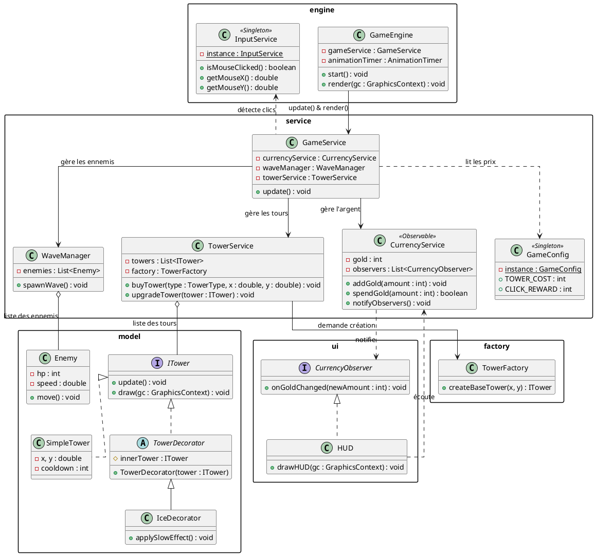
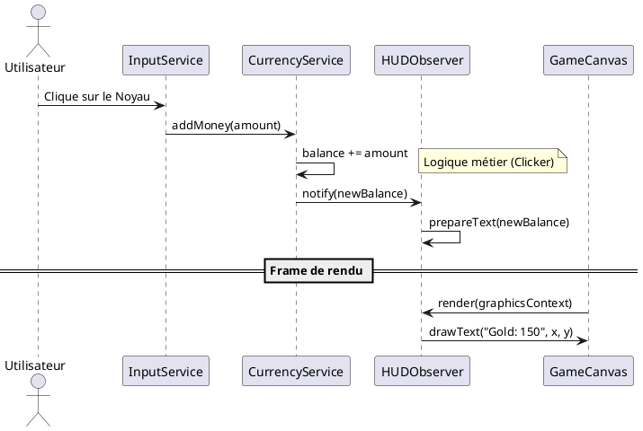

# Conception technique — NKOK Defense

> Ce document décrit l'architecture technique de NKOK Defense. En tant qu'architectes, nous avons privilégié la modularité pour permettre l'ajout futur de tours et d'ennemis sans modifier le cœur du moteur.

## Vue d'ensemble

L'application repose sur une architecture en couches, exploitant le **Canvas JavaFX** pour un rendu haute performance :

1. **Engine (Socle)** — Gère la boucle de jeu (`GameEngine`) et le rendu graphique via le `GraphicsContext`. Contrairement à une approche par nœuds (Nodes), nous dessinons manuellement chaque entité à chaque frame pour plus de fluidité.
2. **Service / Manager** — Orchestre de la logique métier. `CurrencyService` gère l'économie (clics), `WaveManager` gère l'apparition des ennemis, et `TowerService` gère le placement et l'attaque des tours.
3. **Model** — Entités pures : `Tower`, `Enemy`, `Projectile`. Ces classes contiennent les données et les méthodes de mise à jour de leur état.

L'architecture suit un flux de données unidirectionnel :
`Input (Clic/Clavier) → Services (Logique) → Modèles (Données) → Canvas (Rendu)`.

---

## Design Patterns

### DP 1 — Singleton

**Feature associée** : Gestionnaire de configuration (`GameConfig`)

**Justification** : Le jeu possède de nombreuses constantes (prix d'achat initial, dégâts par défaut, récompense par clic, vitesse des vagues). Ces données doivent être partagées par le `Shop`, le `WaveManager` et les `Tours`. Le Singleton garantit que tous les composants lisent la même "source de vérité". Cela facilite l'équilibrage du jeu : modifier une valeur dans le Singleton impacte instantanément tout le logiciel.

**Intégration** : Une classe `GameConfig` avec une instance unique. Elle est accessible par tous les services pour calculer les coûts et les ratios de puissance.

### DP 2 — Observer

**Feature associée** : Mise à jour de l'interface utilisateur (HUD) et du Score

**Justification** : Le système de "Clicker" génère de l'argent très rapidement. Coupler le `CurrencyService` directement à l'affichage (le texte sur le Canvas) rendrait le code illisible. L'Observer permet au `CurrencyService` de notifier tous les abonnés (HUD, Boutique, Succès) dès que le solde change. L'affichage se met à jour uniquement quand la donnée change, sans que le service économique n'ait connaissance de l'existence de l'interface.

**Intégration** : `CurrencyService` implémente une interface `Observable`. Le `HUDManager` s'enregistre comme `Observer` et rafraîchit les visuels à chaque notification de gain ou de dépense.

### DP 3 — Factory

**Feature associée** : Génération des tours et des types d'ennemis

**Justification** : Dans un Tower Defense, on manipule de nombreuses variantes d'objets (Tour d'Archer, Tour de Glace, Ennemi Rapide, Ennemi Tank). Utiliser des `new` partout créerait un couplage fort. La `TowerFactory` centralise la création. Si on décide que toutes les tours doivent désormais avoir un identifiant unique ou un effet sonore à la construction, on ne modifie que la Factory.

**Intégration** : `TowerFactory` possède une méthode `createTower(TowerType type, double x, double y)`. Elle retourne une instance de `Tower` configurée avec les bonnes statistiques de base issues du `GameConfig`.

### DP 4 — Decorator

**Feature associée** : Système d'améliorations de spécialisation (Upgrades)

**Justification** : C'est le cœur de notre fonctionnalité de spécialisation. Au lieu de créer des classes complexes comme `IceTowerWithBigSlowAndAreaEffect`, nous utilisons le Decorator. Une `Tower` de base peut être "enveloppée" par un `RangeDecorator` (augmente la portée), un `AreaEffectDecorator` (ajoute des dégâts de zone) ou un `SlowDecorator` (renforce le ralentissement). Cela permet de cumuler des bonus de manière dynamique et infinie à l'exécution.

**Intégration** : Une classe abstraite `TowerDecorator` qui implémente l'interface `ITower`. Chaque décoration spécifique ajoute sa logique à la méthode `attack()` ou `draw()` avant d'appeler celle de la tour qu'elle contient.

---

## Diagrammes UML

### Diagramme 1 — Architecture des Tours et Decorators

Ce diagramme montre comment le pattern **Factory** crée les tours et comment le **Decorator** permet de les améliorer sans modifier les classes originales.

Diagramme 2 — Séquence d'un "Click" (Système Clicker)
Ce diagramme illustre le flux partant du clic de l'utilisateur jusqu'à la mise à jour de l'affichage via le pattern Observer.

