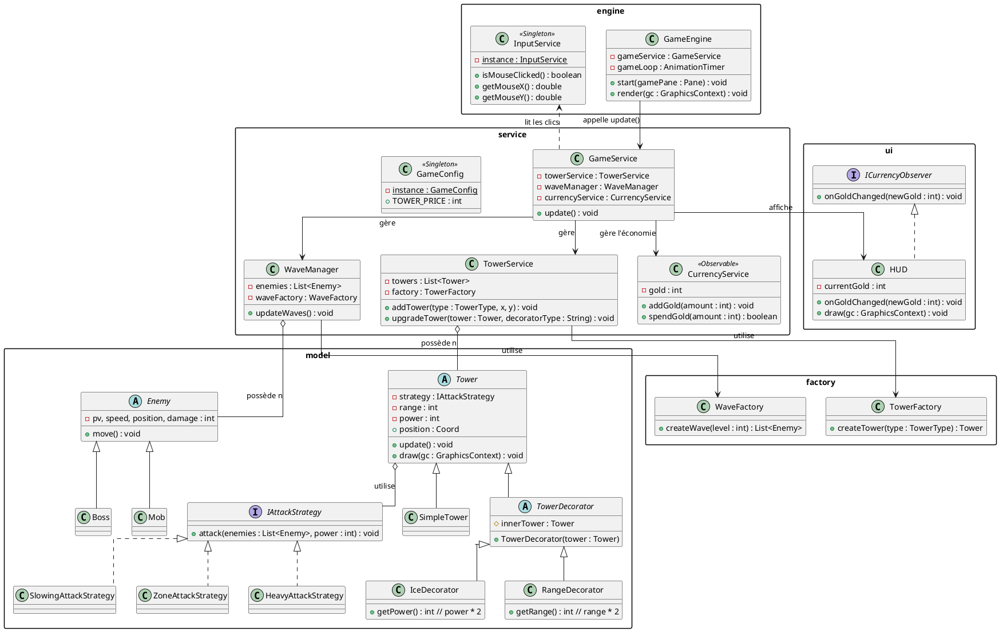
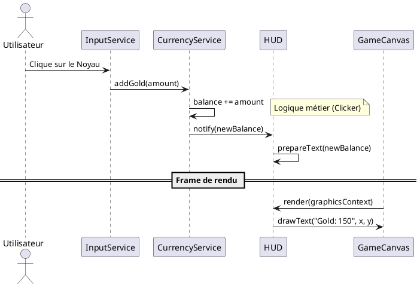

# Conception technique — NKOK Defense

> Ce document détaille l'architecture logicielle du projet NKOK Defense. Nous avons opté pour une structure modulaire permettant de séparer strictement la logique économique (Clicker) de la logique de combat (Tower Defense).

---

## 1. Vue d'ensemble

L'application repose sur une architecture en couches exploitant le **Canvas JavaFX** pour garantir des performances optimales et une grande souplesse graphique :

1. **Engine (Socle)** : Gère la boucle de jeu via un `AnimationTimer` et la capture des entrées utilisateur via un `InputService`. Le rendu est effectué manuellement à chaque frame via le `GraphicsContext`.
2. **Service (Logique métier)** : Orchestre le fonctionnement global. Le `GameService` coordonne les trois piliers du jeu : le `CurrencyService` (gestion de l'or), le `TowerService` (gestion des tours) et le `WaveManager` (gestion des vagues).
3. **Model (Données)** : Contient les entités pures comme `Tower` et `Enemy`, ainsi que les définitions de comportements via les interfaces de patterns.
4. **Factory (Création)** : Centralise l'instanciation des objets complexes pour éviter de disperser les paramètres de configuration dans la logique métier.

---

## 2. Design Patterns (DP)

### DP 1 — Singleton
**Feature associée** : Gestion des entrées (`InputService`) et Configuration globale (`GameConfig`).
**Justification** : Le système doit garantir qu'une seule instance gère les interactions souris pour éviter les conflits de coordonnées et les fuites de mémoire. De même, `GameConfig` centralise les prix, les dégâts et les statistiques pour permettre un équilibrage du jeu en un seul point accessible par tous les services.
**Intégration** : L'accès à ces services se fait via une méthode statique `getInstance()`.

### DP 2 — Observer
**Feature associée** : Mise à jour de l'interface utilisateur (HUD) et Score.
**Justification** : Le `CurrencyService` est le moteur économique du jeu ; il ne doit pas être "pollué" par des références à des éléments graphiques. En utilisant l'Observer, le service notifie simplement ses abonnés (comme le `HUD`) dès que le solde change, permettant une mise à jour visuelle instantanée et découplée.

### DP 3 — Factory
**Feature associée** : Génération des vagues d'ennemis et construction de tours.
**Justification** : Créer un ennemi de type "Boss" ou une tour de type "Glace" nécessite des réglages spécifiques (PV, vitesse, sprites). La `TowerFactory` et la `WaveFactory` isolent cette complexité, permettant au `WaveManager` de générer une vague complète via une seule commande simple.
**Intégration** : Les méthodes de création retournent des types abstraits (`Tower` ou `Enemy`), masquant les classes concrètes au reste du système.

### DP 4 — Decorator
**Feature associée** : Système d'améliorations de spécialisation (Upgrades).
**Justification** : C'est le cœur de notre système d'évolution. Plutôt que de créer des classes rigides pour chaque amélioration, nous "enveloppons" une tour de base avec des décorateurs comme `IceDecorator` (ralentissement) ou `RangeDecorator` (portée). Cela permet au joueur de cumuler plusieurs bonus sur une même tour de manière dynamique.
**Intégration** : `TowerDecorator` hérite de la classe abstraite `Tower` et contient une référence vers la tour qu'il décore, modifiant ses statistiques au vol.

### DP 5 — Strategy
**Feature associée** : Modes d'attaque interchangeables et calculs de gains.
**Justification** : Une tour peut posséder différentes manières de tirer (dégâts de zone, ralentissement, ou tir lourd sur cible unique). Le pattern Strategy permet de changer l'algorithme d'attaque d'une tour sans modifier sa classe. Nous appliquons également ce pattern au système de "clic" pour varier les gains d'or selon les bonus actifs.
**Intégration** : Les tours possèdent une référence vers une interface `IAttackStrategy` interchangeable à l'exécution.

---

## 3. Architecture des données et flux

### Gestion du Rendu (Canvas)
Contrairement au Scene Graph classique de JavaFX, chaque entité (`Tower`, `Enemy`) possède sa propre méthode `draw(GraphicsContext gc)`. Le `GameEngine` parcourt la liste des entités à chaque frame (60 FPS) pour les redessiner sur le Canvas, assurant une fluidité maximale même avec un grand nombre d'ennemis à l'écran.

### Flux de mise à jour
Le cycle de vie d'une frame suit ce cheminement :
1. Capture des clics via `InputService`.
2. Mise à jour de l'économie via `CurrencyService`.
3. Calcul des déplacements et collisions via `WaveManager` et `TowerService`.
4. Notification des changements aux observateurs (`HUD`).
5. Rendu graphique final sur le `GameCanvas`.

---

## Diagrammes UML

### Diagramme 1 — Architecture des Tours et Decorators

Ce diagramme montre comment le pattern **Factory** crée les tours et comment le **Decorator** permet de les améliorer sans modifier les classes originales.

Diagramme 2 — Séquence d'un "Click" (Système Clicker)
Ce diagramme illustre le flux partant du clic de l'utilisateur jusqu'à la mise à jour de l'affichage via le pattern Observer.

