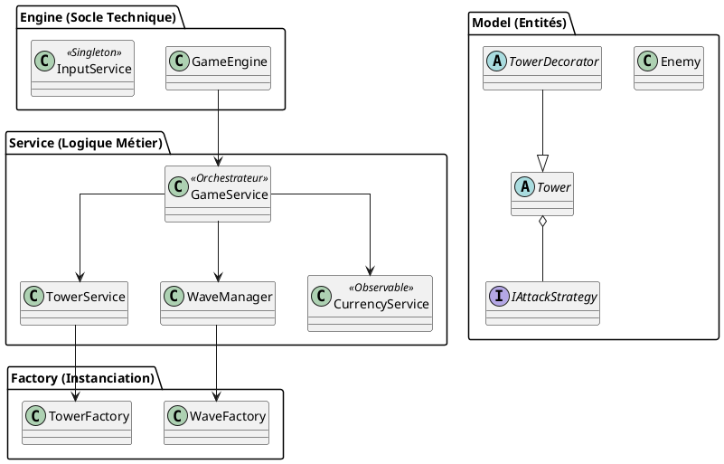

# Document de réversibilité technique — NKOK Defense

> Ce document est destiné à l'équipe qui reprendra la maintenance du projet NKOK Defense. Il détaille l'état réel du code, ses choix d'architecture et ses dettes techniques pour assurer une passation fluide.

## Architecture actuelle

Le projet utilise une architecture en quatre couches, pilotée par l'injection de dépendances via **Google Guice**. Le rendu a été migré vers un **Canvas JavaFX** pour garantir des performances optimales avec de nombreuses entités.



### Flux d'exécution
1.  **Démarrage** : `App.java` initialise l'injecteur Guice. `GameEngine` crée un `Canvas` de 800x600 pixels et l'ajoute au `Pane` principal pour le rendu via `GraphicsContext`.
2.  **Boucle principale** : L' `AnimationTimer` dans `GameEngine` déclenche environ 60 fois par seconde la méthode `update()` de `GameService` pour la physique, puis `render(gc)` pour l'affichage.
3.  **Système de grille (Tiles)** : Le jeu utilise une grille logique de cases de 40x40 pixels. Les positions sont stockées en unités de cases et converties en pixels uniquement lors du rendu.
4.  **Détection de combat** : À chaque frame, `TowerService` calcule la distance entre les tours et les ennemis. Si un ennemi est à portée, la stratégie d'attaque (`IAttackStrategy`) de la tour est exécutée.

## Design Patterns implémentés

*   **Factory** : `TowerFactory` et `WaveFactory` centralisent la création d'objets. Cela permet de modifier les PV des monstres ou le prix des tours en un seul point.
*   **Strategy** : Les tours possèdent un comportement d'attaque interchangeable (`Heavy`, `Zone`, `Slowing`). On peut ajouter un nouveau type de tour simplement en créant une nouvelle classe implémentant `IAttackStrategy`.
*   **Observer** : `CurrencyService` notifie le `HUD` à chaque modification du solde d'or, permettant une mise à jour réactive de l'interface sans couplage fort.
*   **Decorator** : Le système d'amélioration utilise `TowerDecorator`. On enveloppe une tour existante pour augmenter ses statistiques (comme la portée) dynamiquement.
*   **Singleton** : `GameState` et `GameConfig` assurent une source de vérité unique pour les statistiques globales et les constantes du jeu (taille des cases, prix).

## Bugs connus

| Bug | Sévérité | Conditions de reproduction |
| :--- | :--- | :--- |
| **Range des tours** | moyen | La range des tours nous oblige à mettre les tours à une case de la route|
| **Superposition des ennemis** | Mineure | Si plusieurs ennemis ont la même vitesse et apparaissent en même temps, ils se chevauchent parfaitement. |
| **Précision du clic UI** | Mineure | Les zones de détection du Shop sont fixes. Un redimensionnement de la fenêtre peut décaler les clics par rapport au visuel. |

## Limitations techniques

*   **Absence de projectiles visuels** : Les dégâts sont appliqués instantanément par calcul de distance. Il n'y a pas de représentation graphique des tirs (flèches ou boules de feu).
*   **Chemin linéaire unique** : Le chemin des ennemis est codé en dur sur une ligne fixe (`PATH_ROW = 7`). Le système ne supporte pas de tracés complexes.
*   **Rendu géométrique uniquement** : Pour maximiser les performances et la simplicité, le jeu n'utilise pas d'images (sprites) mais des formes géométriques de base.

## Points de vigilance pour la reprise

*   **Modification du moteur** : `GameEngine.java` a été modifié pour supporter le Canvas. Toute nouvelle entité visuelle doit être ajoutée dans la méthode `render()` de `GameService`.
*   **Échelle des vitesses** : Sur une grille, une vitesse de `1.0` est extrêmement rapide. Les vitesses fluides se situent entre `0.01` et `0.05`.
*   **Zones de clic** : Le shop et le noyau de production d'or utilisent des coordonnées fixes dans la zone `x > 600`.

## Améliorations recommandées

| Amélioration | Difficulté | Justification |
| :--- | :--- | :--- |
| **Effets de tir** | Facile | Tracer une ligne temporaire entre la tour et l'ennemi lors d'une attaque. |
| **PV de la Base** | Facile | Ajouter un compteur de vie pour le joueur et un écran de défaite si des ennemis traversent la carte. |
| **Vagues infinies** | Moyen | Relancer automatiquement une vague plus difficile dès que la liste d'ennemis est vide. |
| **Automatisation** | Moyen | Ajouter une amélioration "Revenus Passifs" qui génère de l'or automatiquement chaque seconde. |
````</Observable></Orchestrateur></Singleton>